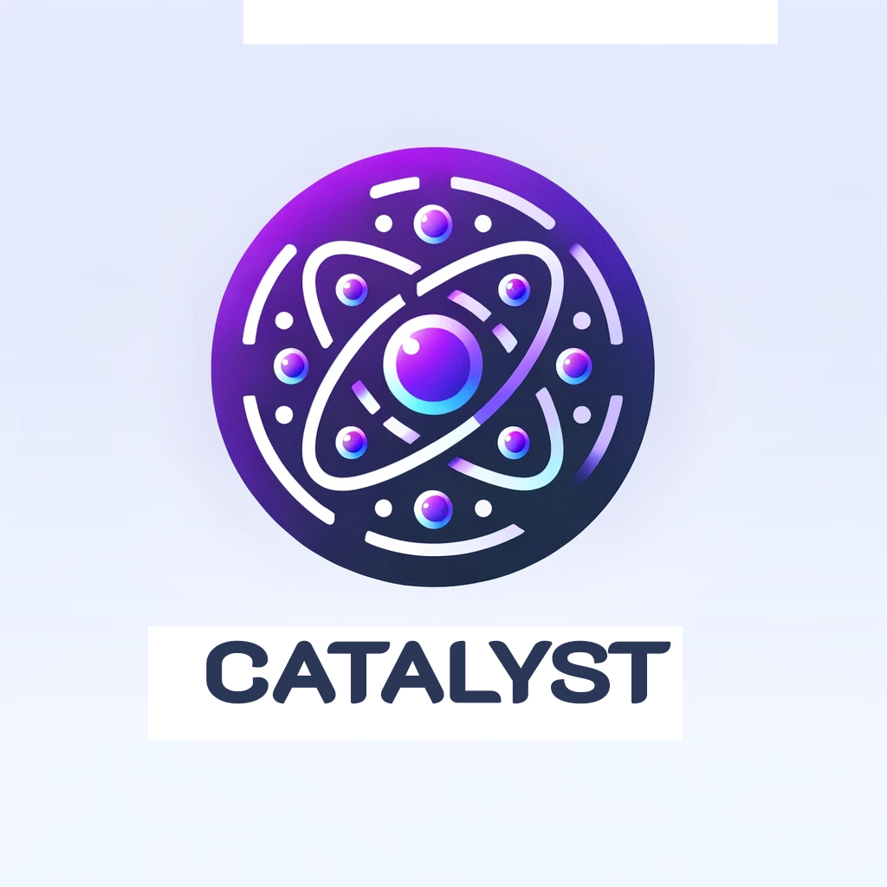

# Catalyst

  

## Overview

The Catalyst smart contract is a Rust-based contract designed to work as a fast bridging solution between blockchains outside of the Cosmos ecosystem, but utilizing Osmosis as the intermediary.

At a high level, this contract acts as a pseudo order book, where bridge transactions from an external blockchain (such as the Bitcoin network) are listed prior to receiving sufficient confirmations. If a bridge transaction is posted to this contract, a market maker is able to fill the order by sending the appropriate amount of tokens to the contract, which in turn immediately get forwarded to the desired end location. As a reward for taking on the risk of block reorgs, the market maker is able to claim a portion of the amount being bridged. When the funds are finally cleared from the origin chain, the market maker is able to claim the remaining portion of the bridged funds.

If the transaction stays posted to Catalyst beyond the time the Osmosis protocol deems as safe (usually 6 confirmations on the Bitcoin network), the transaction is removed from the order book and continues on it's normal flow.

## Transaction Lifecycle

The lifecycle of a transaction is as follows:

1. Funds on an external native chain are sent to the Osmosis validator multi-sig's native address on that native chain.

2. Once a single confirmation is received, the transaction is posted to the Catalyst contract as a `pending_tx`, along with the desired destination address and the amount to be bridged. The destination address can be one of two things:
    - A personal address on the Osmosis network, implying this bridge transaction is for the purpose of bridging funds from an external chain to store on the Osmosis network (i.e. Native BTC to native Osmosis BTC).
    - A connecting bridge address, implying this bridge transaction is for the purpose of bridging funds from an external chain to another external chain, but utilizing Osmosis as the intermediary (i.e Native BTC to native ETH).

3. A market maker is able to fill the order by selecting a `pending_tx` from the order book and sending the appropriate amount of tokens to the contract, which in turn immediately get forwarded to the desired end location.
    - If the destination address is a personal address on the Osmosis network, the market maker provides the amount of tokens in the same denomination as the bridged funds. For example, if the bridged funds are in BTC, the market maker provides the amount of tokens in BTC, less the market maker fee.
    - If the destination address is a connecting bridge address, the market maker provides the amount of tokens in the denomination of the destination bridge, minus the market maker fee. For example, if bridging from BTC to ETH, the market maker provides the amount of tokens in ETH, minus the market maker fee.

4. After the funds are forwarded to the destination address, the contract moves the selected `pending_tx` to a `fulfilled_tx` status. This implies that the market maker has successfully filled the order, the funds have been forwarded to the desired end location, and the market maker is waiting on the original funds to be cleared from the origin chain.

5. Once the funds are cleared from the origin chain, the protocol checks to see if the transaction is in a `pending_tx` or `fulfilled_tx` status. If the transaction is in a `pending_tx` status, the protocol deletes the `pending_tx`, and the transaction goes through the normal flow, implying that no market maker fulfilled this transaction. If the transaction is in a `fulfilled_tx` status, the protocol sends the funds to the market maker, and then removes the transaction from the `fulfilled_tx` list, thereby completing the transaction lifecycle.
